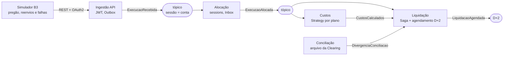

# PosTrade Lab

**Plataforma de pós-negociação de ações orientada a eventos, em .NET 8.** Recebe execuções de um pregão simulado, aloca nas contas dos clientes, calcula custos, concilia com o arquivo da Clearing e agenda a liquidação em D+2, com todos os serviços se comunicando por mensageria.


> **Projeto de estudo.** Os dados, ativos, taxas e arquivos são fictícios e simplificados. O objetivo é exercitar arquitetura orientada a eventos com problemas reais do domínio, não reproduzir os protocolos ou layouts oficiais da B3. Sem vínculo com a B3 ou com qualquer instituição financeira.

---

## Por que este projeto

Pós-negociação é um domínio em que erro custa dinheiro: uma execução processada duas vezes vira uma alocação duplicada, um evento perdido vira uma liquidação que não acontece, e eventos fora de ordem quebram a posição do cliente. Por isso ele força a resolver, na prática, os problemas centrais de sistemas distribuídos:

- **Idempotência**: a mesma execução pode chegar várias vezes (reenvio da origem, retry, redrive da DLQ) e deve gerar efeito uma única vez.
- **Ordem**: eventos de uma mesma conta precisam ser processados em sequência, sem perder paralelismo entre contas.
- **Consistência sem transação distribuída**: gravar no banco e publicar o evento sem *dual write* (Outbox) e coordenar um fluxo longo com compensação (Saga).
- **Falhas como rotina**: retry com backoff, DLQ com reprocessamento e alertas.
- **Independência de broker**: o mesmo domínio rodando sobre Azure Service Bus, RabbitMQ e SNS/SQS.

## Arquitetura



Cada serviço tem **banco próprio** (database per service), segue **Clean Architecture** e conversa com os outros apenas por eventos.

| Serviço | Responsabilidade | Padrões principais |
| --- | --- | --- |
| **Ingestão** | recebe as execuções do pregão, valida e publica `ExecucaoRecebida` | Outbox transacional, OAuth2 Client Credentials, 202 Accepted |
| **Alocação** | divide cada execução entre as contas dos clientes | Inbox, sessions por conta (ordem), idempotência por ID de negócio |
| **Custos** | calcula corretagem e emolumentos | Strategy, idempotência com Redis + unique constraint |
| **Liquidação** | acompanha cada alocação até D+2 e concilia com a Clearing | Saga (máquina de estados), mensagens agendadas, lock distribuído |
| **Simulador B3** | gera o pregão, injeta falhas e verifica o resultado ponta a ponta | Decorator (caos), seed reproduzível, rate limiting, Channels |

### Eventos

| Evento | Publicado por | Consumido por |
| --- | --- | --- |
| `ExecucaoRecebida` | Ingestão | Alocação, Auditoria |
| `ExecucaoCancelada` | Ingestão | Alocação, Liquidação |
| `ExecucaoAlocada` | Alocação | Custos, Liquidação, Posição |
| `CustosCalculados` | Custos | Liquidação |
| `DivergenciaConciliacao` | Conciliação | Operação |
| `LiquidacaoAgendada` | Liquidação | Auditoria |

## Decisões técnicas

| Decisão | Motivo |
| --- | --- |
| **Entrega pelo menos uma vez + consumidor idempotente** | entrega exatamente uma vez não é garantida entre sistemas; o que se garante é efeito único |
| **Outbox no produtor, Inbox no consumidor** | elimina o *dual write* entre banco e broker e descarta reentregas na mesma transação |
| **Sessions com a conta como chave** | ordem garantida por conta e paralelismo entre contas (equivalente ao `MessageGroupId` do SQS FIFO) |
| **Saga para a liquidação** | o fluxo dura dias, envolve vários eventos e precisa reagir a cancelamentos |
| **`decimal` para preço e quantidade** | valores financeiros nunca em ponto flutuante |
| **Correções como novos eventos** | registros financeiros não são alterados em silêncio; estornos deixam trilha |
| **Mensageria abstraída do domínio** | permite trocar o transporte (Service Bus, RabbitMQ, SNS/SQS) sem tocar nas regras |

## Stack

| Área | Tecnologias |
| --- | --- |
| Backend | C# 12, .NET 8, ASP.NET Core, Entity Framework Core |
| Mensageria | Azure Service Bus (emulador local), RabbitMQ, AWS SNS/SQS via LocalStack |
| Dados | SQL Server 2022, Redis |
| Segurança | OAuth2 (Client Credentials), JWT, Keycloak |
| Observabilidade | OpenTelemetry, Serilog, Seq, Jaeger |
| Infra | Docker Compose, Kubernetes (kind) com KEDA, GitHub Actions |
| Testes | xUnit, FluentAssertions, Testcontainers, test harness em memória |

## Como rodar

Pré-requisitos: **Docker** (no Windows, Docker Desktop com WSL 2 e pelo menos 4 GB de memória) e **.NET 8 SDK**.

**Windows (PowerShell):**

```powershell
git clone https://github.com/douglascost47/pos-trade.git
cd pos-trade
.\scripts\setup-windows.ps1        # diagnóstico da máquina: WSL, Docker, memória, portas
.\scripts\ambiente.ps1 verificar   # sobe o ambiente e roda o smoke test
```

**Linux, macOS ou WSL:**

```bash
git clone https://github.com/douglascost47/pos-trade.git
cd pos-trade
./scripts/check-env.sh
```

Isso sobe SQL Server, o emulador do Azure Service Bus (com tópicos, assinaturas e sessions já declarados) e o Seq, e roda uma verificação que exercita fila, detecção de duplicidade, retry até a DLQ, fan-out, ordem por sessão e filtro de correlação.

| Serviço | Endereço |
| --- | --- |
| SQL Server | `localhost,1433` (usuário `sa`, senha no `.env`) |
| Service Bus (AMQP) | `localhost:5672` |
| Service Bus (gestão e health) | `http://localhost:5300` |
| Seq (logs) | http://localhost:5341 |

Guias detalhados: [ambiente local](README-ETAPA0.md) · [passo a passo no Windows](README-WINDOWS.md).

## Estrutura

```text
pos-trade/
├─ deploy/
│  ├─ servicebus/Config.json     # topologia do emulador do Service Bus
│  └─ sql/                       # criação dos bancos dos serviços
├─ scripts/                      # ambiente local (PowerShell e Bash)
├─ tools/Etapa0.SmokeTest/       # verificação do ambiente com o SDK do Service Bus
├─ src/                          # (em construção)
│  ├─ Contracts/                 # eventos compartilhados
│  ├─ Ingestao/                  # Api / Application / Domain / Infrastructure
│  ├─ Alocacao/
│  ├─ Custos/
│  ├─ Liquidacao/
│  └─ Simulador.B3/
├─ tests/                        # (em construção)
└─ docker-compose.yml
```

## Roteiro

O projeto é construído em etapas, cada uma terminando com algo funcionando.

| Etapa | Conteúdo | Status |
| --- | --- | --- |
| 0 | Ambiente local com Docker: SQL Server, emulador do Service Bus, Seq, smoke test | ✅ concluída |
| 1 | Solução em Clean Architecture | ⏳ |
| 2 | Domínio e contratos de eventos | ⏳ |
| 3 | Ingestão com Outbox e OAuth2/JWT | ⏳ |
| 4 | Consumidores idempotentes e ordem com sessions | ⏳ |
| 5 | Retry, DLQ e redrive | ⏳ |
| 6 | Saga de liquidação D+2 e conciliação | ⏳ |
| 7 | Testes: unitários, harness e Testcontainers | ⏳ |
| 8 | Observabilidade, Kubernetes com KEDA e CI/CD com rollback | ⏳ |
| 9 | Troca de transporte: RabbitMQ e SNS/SQS | ⏳ |
| 10 | Redis: cache, read model, lock distribuído e idempotência | ⏳ |
| 11 | Simulador B3: modo caos, arquivo da Clearing e verificador ponta a ponta | ⏳ |

## Limitações conhecidas

- O emulador do Service Bus não persiste mensagens entre reinícios, limita o TTL a 1 hora e aceita poucas conexões simultâneas. Por isso a liquidação usa um relógio comprimido em ambiente local (1 dia útil = 1 minuto).
- O emulador expõe a gestão de entidades numa porta separada, o que afeta bibliotecas que criam a topologia automaticamente. A topologia fica declarada em `deploy/servicebus/Config.json`.
- Feriados, calendário de liquidação e cálculo de emolumentos são simplificados.

## Autor

**Douglas Costa**, desenvolvedor full-stack .NET com experiência em fintech (crédito consignado e consórcio).

[LinkedIn](https://www.linkedin.com/in/<seu-perfil>) · [GitHub](https://github.com/douglascost47)